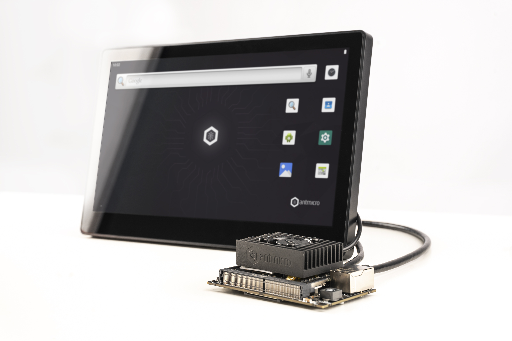

# AOSP on NVIDIA Jetson Nano



This README contains build instructions for creating an AOSP image intended to be run on the Nvidia Jetson Nano platform.
Preparing a BSP for running this image on Antmicro's Jetson Nano Baseboard is described [in a separate guide](README_Jetson_Nano_BSP.md).

## Build instructions - AOSP image

The following instructions are targeted for a Debian 10 system; the package installation process needs to be adjusted to your specific distribution.

1. Install required dependencies

```
sudo apt-get install git git-core build-essential bc wget xxd python python3 locales-all curl ninja-build procps unzip m4 libncurses5 rsync
```

2. Fetch and install the repo tool

```
mkdir -p ~/bin
PATH=~/bin:$PATH
curl https://storage.googleapis.com/git-repo-downloads/repo > ~/bin/repo
chmod a+x ~/bin/repo
```

3. Fetch the AOSP sources

```
mkdir aosp
cd aosp
repo init -u https://github.com/antmicro/kvm-aosp-manifest.git -b kvm-aosp
repo sync
```

4. Configure and build the AOSP image

```
source build/envsetup.sh
lunch aosp_arm64-eng
m
```

5. Create RW images for the system and vendor partitions

By default the system and vendor images use the ext4 filesystem with a feature called `EXT4_FEATURE_RO_COMPAT_SHARED_BLOCKS`, which makes it impossible to mount with write permissions. SELinux needs write access to those partitions during boot, so they need to be recreated to allow it.

```
mkdir {system,vendor}-r{o,w}
dd if=/dev/zero of=system-rw.img bs=512 count=6291456
mkfs.ext4 system-rw.img -L "/"
sudo mount system-rw.img system-rw
sudo mount out/target/product/generic_arm64/system.img system-ro -o ro
sudo rsync -avxHAX system-r{o,w}/
sudo umount system-r{o,w}
mv system-rw.img out/target/product/generic_arm64/system.img
```

```
dd if=/dev/zero of=vendor-rw.img bs=512 count=1048576
mkfs.ext4 vendor-rw.img -L "vendor"
mount vendor-rw.img vendor-rw
mount out/target/product/generic_arm64/vendor.img vendor-ro -o ro
rsync -avxHAX vendor-r{o,w}/
sudo umount vendor-r{o,w}
mv vendor-rw.img out/target/product/generic_arm64/vendor.img
```

### Output files

The output of the AOSP build are partition images. The resulting files required to run the system are:
```
out/target/product/generic_arm64/vendor.img
out/target/product/generic_arm64/system.img
out/target/product/generic_arm64/userdata.img
out/target/product/generic_arm64/ramdisk.img
```

## Build instructions - AOSP kernel

1. Fetch the kernel sources

```
mkdir aosp_kernel
cd aosp_kernel
repo init -u https://android.googlesource.com/kernel/manifest -b q-common-android-4.14
repo sync
```

2. Configure and build the kernel

```
BUILD_CONFIG=./common/build.config.cuttlefish.aarch64 ./build/build.sh
```

### Output files

The resulting file needed to run the system is the kernel image, located here:
```
out/android-4.14-q/common/arch/arm64/boot/Image
```
